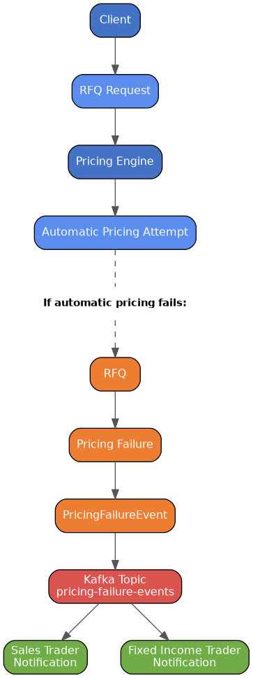
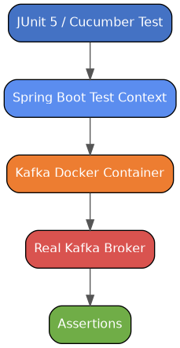
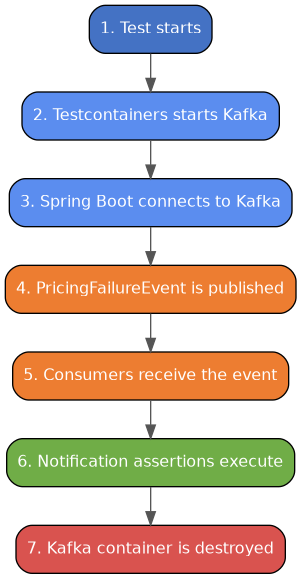

# Fixed Income Pricing Failure Notification


---

# Overview

This project demonstrates **integration testing of a Spring Boot Kafka application using Testcontainers**.

The project simulates a simplified fixed-income pricing workflow where an automatic pricing failure generates a business event.

The primary purpose of this repository is to demonstrate:

- Spring Boot Kafka integration testing
- Real Kafka infrastructure using Testcontainers
- Event-driven messaging
- Kafka producers and consumers
- BDD testing with Cucumber

This is a **test-focused demonstration project**.

This is a test-focused demonstration project.

---

# Business Scenario

A fixed-income trading platform receives RFQs (Requests For Quote).

The pricing engine attempts to automatically generate a tradable price.

High-level workflow:



The integration test validates that the pricing failure event is correctly delivered to multiple consumers.

---

# Event-Driven Design

The pricing component publishes a business event, `PricingFailureEvent`, when automatic pricing fails for an RFQ.

The producer has no knowledge of:

- who consumes the event
- how many consumers exist
- what action each consumer performs

This decoupling means new consumers — an audit log, a risk dashboard, an additional notification channel — can be added later without any change to the Pricing Engine or its publishing code.

```
Pricing Engine

    |

    |

PricingFailureEvent

    |

    |

Kafka Topic

    |

    |

Multiple Consumers
```

This demonstrates loose coupling between producers and consumers.

---

# Kafka Recipient List Pattern

This project demonstrates the Recipient List enterprise integration pattern using Kafka topics and independent consumer groups.

A single event is delivered to multiple independent consumers.


Kafka topics and consumer groups allow multiple independent consumers to receive the same event.

---

# Domain Event

The main business event is **`PricingFailureEvent`**.

It represents the business fact that automatic pricing has failed for an RFQ.

The event contains:

- eventId
- rfqId
- instrument
- assetClass
- failureReason
- occurredAt

Example:

```json
{
  "eventId": "7d7c8b9a",
  "rfqId": "RFQ-10001",
  "instrument": "UK GILT",
  "assetClass": "FIXED_INCOME",
  "failureReason": "PRICING_TIMEOUT",
  "occurredAt": "2026-08-02T10:30:00Z"
}
```

# Kafka Producer

The producer publishes pricing failure events.

The producer only knows about the event.

It does not contain trader notification logic.

#  Kafka Consumers

The project contains two Kafka consumers.

Both consumers subscribe to the same Kafka topic but use different consumer groups, ensuring each receives its own copy of every `PricingFailureEvent`.

Both consume the same Kafka topic using different consumer groups.
      
Each consumer delegates notification handling to:

**`TraderNotificationService`**

This separates:

- Kafka message handling
- Business notification logic

# Why Testcontainers?

The main objective of this project is demonstrating integration testing using Testcontainers.

Instead of mocking Kafka, the tests start a real Kafka broker inside Docker.

Mock based testing:

This verifies application interactions but does not verify real Kafka communication.

It does not prove:

- Kafka connectivity
- Serialization
- Consumer configuration
- Topic communication
- Message delivery



Benefits:

- Real infrastructure testing
- Repeatable test environment
- No manual Kafka installation
- Same Kafka communication protocol used in production

# Test Lifecycle

During integration testing:



# Development Environment

This project supports GitHub Codespaces using a Dev Container.

The Dev Container provides:

- Java 21
- Maven
- VS Code Java tooling
- Docker support

The developer does not need to install Kafka locally.

Project Structure

```
fixed-income-pricing-failure-notification
├── .devcontainer
│
├── src
│
│   ├── main
│   │
│   │   └── java/com/company/pricing
│   │
│   │       ├── config
│   │       ├── domain
│   │       ├── messaging
│   │       │
│   │       │   ├── publisher
│   │       │   └── consumer
│   │       │
│   │       └── notification
│   │
│   └── test
│
│       └── resources
│
│           └── application-test.yml
│
├── pom.xml
└── README.md
```

# Test Configuration

This repository contains test configuration only.

Configuration location:

src/test/resources/application-test.yml

Kafka connection details are supplied dynamically by Testcontainers.

During testing:

```
    Spring Boot Test Context

          |

          |

Dynamic Kafka Bootstrap Server

          |

          |

Kafka Testcontainer
```

The test does not require:

Local Kafka installation
External Kafka broker
Manually configured infrastructure

# Running Tests

Execute:

```bash
mvn clean test
```

The integration tests automatically:

- Start Kafka using Testcontainers
- Start the Spring Boot test context
- Publish `PricingFailureEvent` messages
- Verify consumer behaviour
- Shut down the Kafka container

# BDD Integration Test

The acceptance test verifies the following business scenario:

```gherkin
Scenario: Notify traders when automatic pricing fails

  Given automatic pricing has failed for an RFQ
  When the pricing failure event is published
  Then the Sales Trader is notified
  And the Fixed Income Trader is notified
```

The test validates:

- Kafka publishing
- Kafka consumption
- Event serialization
- Multiple consumer groups
- Notification handling

# Technologies Used

| Technology | Purpose |
|---|---|
| Java 21 | Programming language |
| Spring Boot | Application framework |
| Spring Kafka | Kafka integration |
| Apache Kafka | Event messaging |
| Testcontainers | Starts a real Kafka broker for integration tests |
| Docker | Container runtime |
| JUnit 5 | Testing framework |
| Cucumber | BDD testing |
| Maven | Build tool |

# Author

JFSoftwareServices