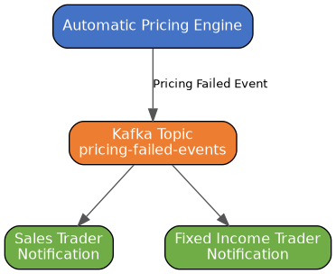
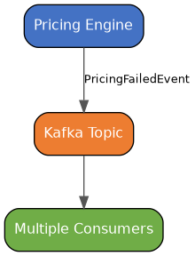

# Fixed Income Pricing Failure Notification

## Overview

This project demonstrates an event-driven notification workflow
within a fixed income trading platform.

The business scenario:

> When an automatic pricing attempt fails,
> the Sales Trader and Fixed Income Trader
> must be notified.

The project demonstrates:

- Spring Boot
- Apache Kafka
- Enterprise Integration Patterns
- Recipient List pattern
- BDD integration testing
- Testcontainers
- GitHub Actions

## Development Environment

This project uses GitHub Codespaces with a Dev Container.

The container provides:

- Java 21
- Maven
- VS Code Java extensions
- Docker support

The application can be developed without installing Java locally.

## Opening in Codespaces

1. Open repository

2. Select:

Codespaces → Create codespace

3. The environment automatically builds:

Java 21
Maven
VS Code tooling

Verify:

java -version

Expected:

java version "21.x.x"
---

# Business Flow

---

# Design Goal

The pricing engine publishes one event.

It does not know who consumes it.

Example:

Adding a new consumer should not require
changing the pricing engine.

---

# Future Implementation

The project will add:

## Kafka

Messaging backbone.

## Recipient List Pattern

Multiple independent consumers receive
the same business event.

## Testcontainers

Integration tests will run against
a real Kafka broker started automatically
inside Docker.

The application will use the same
communication protocol as production.
